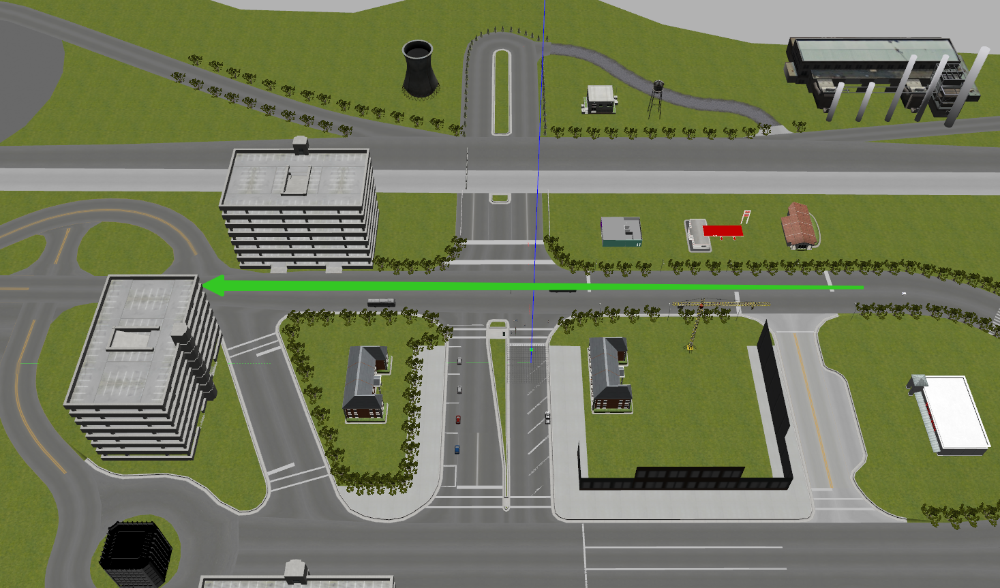
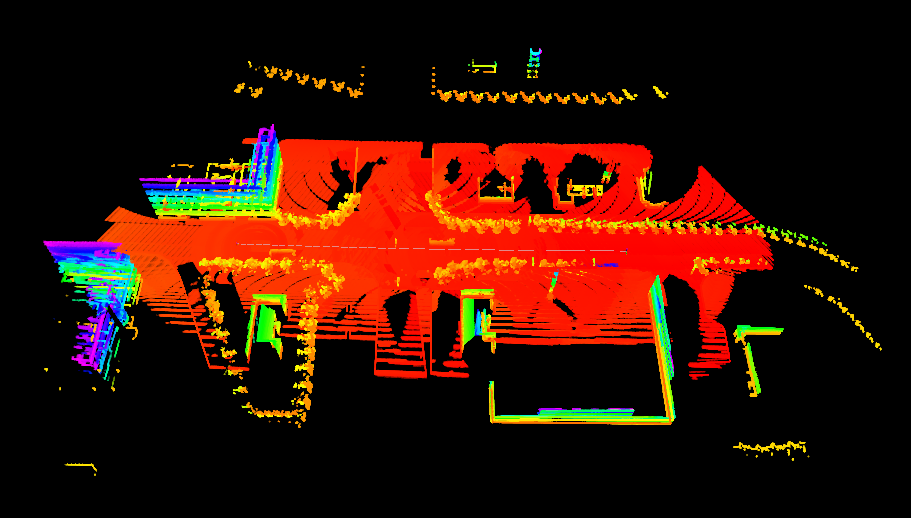
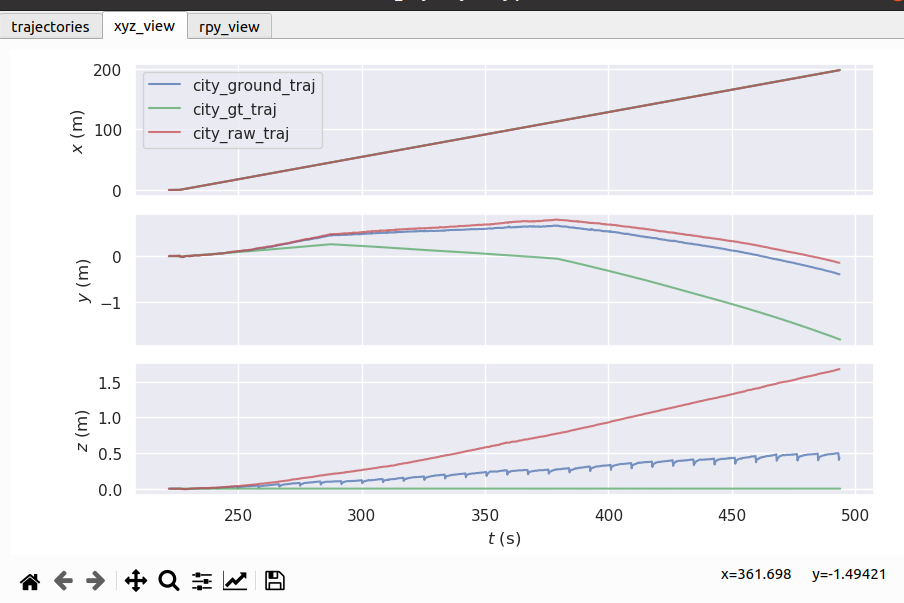

# LIO-SAM-with-Ground-Constraint

**A real-time lidar-inertial odometry package. We strongly recommend the users read this document thoroughly and test the package with the provided dataset first. A video of the demonstration of the method can be found on [YouTube](https://www.youtube.com/watch?v=A0H8CoORZJU).**
# System architecture

    

We design a system that maintains two graphs and runs up to 10x faster than real-time.
  - The factor graph in "mapOptimization.cpp" optimizes lidar odometry factor and GPS factor. This factor graph is maintained consistently throughout the whole test.
  - The factor graph in "imuPreintegration.cpp" optimizes IMU and lidar odometry factor and estimates IMU bias. This factor graph is reset periodically and guarantees real-time odometry estimation at IMU frequency.

# Ground-Constraint
在大场景环境下的建图测试中，我们发现原始的slam系统没有一个好的z轴约束，原因可能在于velodyne-16线束较为稀疏，导致建图时地图上翘。

测试采用的仿真环境如下，其中机器人以一个直线录制数据集，如绿色箭头所示：

    

利用原始lio-sam算法得到的仿真地图如下：

    

将gazebo的真值，原始lio-sam里程计和地面约束后的lio-sam里程计转换成TUM格式，利用evo测试他们的误差。可以发现，加上地面约束后，z轴的误差明显减小。

    

